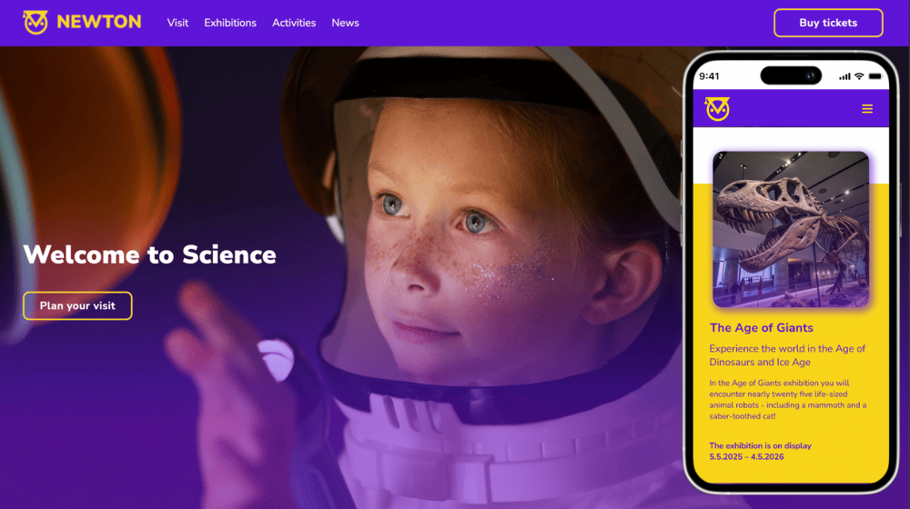

# Project Title
🌏 Newton - Community Science Museum

## Screenshot


Newton - Community Science Museum - Front-End Interface
An interactive science museum with a primary target audience of primary and secondary school-aged children (7 to 15 years old) and families with small children.

Figma design: [https://www.figma.com/design/fZJaCBipwON3ZDBCVvoG2G/SP1_Marina-Kovaleva?node-id=0-1&p=f&t=22VRy0FiKjjhJuRX-0](https://www.figma.com/design/fZJaCBipwON3ZDBCVvoG2G/SP1_Marina-Kovaleva?node-id=0-1&p=f&t=22VRy0FiKjjhJuRX-0)

## Description
Newton - Community Science Museum. The website is designed to provide information about the museum, showcase exhibits, and offer visitors easy access to important details such as opening hours, location, and events. It is a responsive web site developed using HTML, CSS including:
- Home page with 
   - bright, attractive design;
   - section with basic information about the museum;
   - cards of popular exhibitions;
   - section with museum news;
   - session of additional activities;
   - section for subscribing to museum news
- Plan your visit page with
   - information about the mezei divided into logical blocks;
   - sections with all the services provided by the museum;
- All exhibitions page with
   - list of all permanet exhibitions with descriptions;
   - section with museum news;
- Specific exhibition page
   - description
   - photos of the bright elements of the exhibition
   - "Fun fackt" section
   - section with few other popular exhibitions
- Coming soon page 
---

## Built With
List the main tools and technologies used in this project:

- HTML
- CSS
---

## Installation

Follow these steps to get a copy of the project running locally:

1. Clone the repository:
   ```bash
   git clone https://github.com/M-Kovaleva/sp1_marina_kovaleva
   ```

2. Open the repository:
   ```bash
   cd your-repo-name
   ```
3. Run Live Server

Link to deployed web application: https://m-kovaleva.github.io/sp1_marina_kovaleva/

## License

MIT License

## Contact
Marina Kovaleva - owlet.savvina@gmail.com
Project Link: [https://github.com/M-Kovaleva/sp1_marina_kovaleva](https://github.com/M-Kovaleva/sp1_marina_kovaleva)
